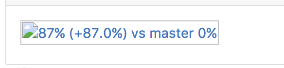
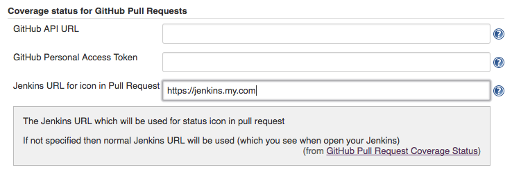

# GitHub Pull Request Coverage Status Plugin for Jenkins

Code coverage icon for GitHub pull requests

[](https://ci.jenkins.io/job/Plugins/job/github-pr-coverage-status-plugin/job/master/)

* [Overview](#overview)
* [Supports coverage reports](#supports-coverage-reports)
* [How to use](#how-to-use)
  * [Install Plugin](#install-plugin)
  * [Configure access to GitHub](#configure-access-to-github)
  * [Configure master coverage source](#configure-master-coverage-source)
    * [Jenkins build](#jenkins-build)
    * [Sonar](#sonar)
  * [Publish coverage for Pull Request](#publish-coverage-for-pull-request)
    * [GitHub Pull Request Builder Plugin](#github-pull-request-builder-plugin)
    * [Branch API Plugin](#branch-api-plugin)
    * [Other](#other)
* [How to use with Jenkins Pipelines](#how-to-use-with-jenkins-pipelines)    
* [Troubleshooting](#troubleshooting)
* [Changelog](#changelog)

## Overview

Parse code coverage report generated by build and post code coverage status comment to GitHub pull request:


## Supports coverage reports
* Jacoco ```jacoco.xml```
* Cobertura ```cobertura.xml``` or ```cobertura-coverage.xml```
* Clover ```clover.xml```
* [SimpleCov JSON (Ruby)](https://github.com/vicentllongo/simplecov-json) ```coverage.json```
 
## How to use

### Install Plugin

* Install plugin from Jenkins Plugin Repository
* Or manually 
  * Goto [releases](https://github.com/jenkinsci/github-pr-coverage-status-plugin/releases)
  * Download latest version of plugin *.hpi* file
  * Install to your Jenkins [guide](https://jenkins.io/doc/book/managing/plugins/)

### Configure access to GitHub

* Goto ```Manage Jenkins``` | ```Configure System```
* Find section ```Coverage status for GitHub Pull Requests```
* Configure global settings of plugin
  * GitHub API URL keep blank for GitHub.com and fill if for dedicated instance of GitHub, example: ```http(s)://hostname/api/v3/```
  * Set [Personal Access Token](https://github.com/blog/1509-personal-api-tokens) (or keep blank if anonymous access enabled)

### Configure master coverage source

To be able compare Pull Request coverage plugin needs master coverage for GitHub repository. 

#### Jenkins build

* Add *Record Master Coverage* post build step to build which tests your master. 
Coverage will be stored per repository URL

#### Sonar

You have the option to get the master coverage (base coverage) from your SonarQube instance. Otherwise the plugin will keep track of the master coverage in the project configuration file.

* Goto ```Manage Jenkins```
* Find section ```Coverage status for GitHub Pull Requests```
* Fill ```Sonar URL``` field - e.g. `http://sonar.mycompany.com`
* Turn On ```Use Sonar for master coverage```
* Optionally use can specify your personal ```Sonar access token```. 
* The next pull request build will use SonarQube as the the source for master coverage

The plugin will try to find the project in SonarQube based on the repository name. If more than one projects match, a warning is logged, and the first one will be used to get the coverage data. 

### Publish coverage for pull request

Depends on plugin which you are using to run (trigger) pull request in Jenkins.

#### GitHub Pull Request Builder Plugin

* To Jenkins Job triggered by [GitHub pull request builder plugin](https://plugins.jenkins.io/ghprb/) add *Publish coverage to GitHub* post build step
* Ensure that build create code coverage report file

#### Branch API Plugin

* To Jenkins Job triggered by [Branch API Plugin](https://plugins.jenkins.io/branch-api/) add *Publish coverage to GitHub* post build step
* Ensure that build create code coverage report file

#### Other

* Before ```Publish coverage to GitHub``` step inject ```CHANGE_ID``` and ```CHANGE_URL``` to build envs
where first one is Pull Request ID (number) and second link to repository
* Add *Publish coverage to GitHub* post build step to build
* Ensure that build create code coverage report file

## How to use with Jenkins Pipelines
* After running tests set build result to Success
    * ```currentBuild.result = 'SUCCESS'```
* Trigger MasterCoverageAction to collect master coverage (scmVars is needed for multibranch)
    *  ```step([$class: 'MasterCoverageAction', scmVars: [GIT_URL: env.GIT_URL]])```
    * Optionally you can specify jacoco counter type like this:
    ```step([$class: 'MasterCoverageAction', jacocoCounterType: 'INSTRUCTION', scmVars: [GIT_URL: env.GIT_URL]])```
    * You can also specify how the result will pe published (comment or status check). By default it will be published as a status check
    ```step([$class: 'MasterCoverageAction', jacocoCounterType: 'INSTRUCTION', publishResultAs: 'statusCheck', scmVars: [GIT_URL: env.GIT_URL]])```
* Trigger CompareCoverageAction to compare coverage and publish results (scmVars is needed for multibranch)
    *  ```step([$class: 'CompareCoverageAction', scmVars: [GIT_URL: env.GIT_URL]])```
    * Optionally use can specify here jacoco counter type and sonar login and sonar password like this:
        ```step([$class: 'CompareCoverageAction', jacocoCounterType: 'INSTRUCTION', sonarLogin: "login", sonarPassword: "password"])```
    * You can also specify how the result will pe published (comment or status check). By default it will be published as a status check
        ```step([$class: 'MasterCoverageAction', jacocoCounterType: 'INSTRUCTION', publishResultAs: 'statusCheck', scmVars: [GIT_URL: env.GIT_URL]])```

* Simple Multibranch Pipeline example
```groovy
 pipeline {
    agent {
        label 'linux'
    }
    tools {
        maven 'maven-3.0.3' 
    }
    stages {
        stage('Checkout') {
            steps {
                checkout scm
            }
        }
        stage('Build and Test') {
            steps {
                sh 'mvn clean package'
            }
        }
        stage('Record Coverage') {
            when { branch 'master' }
            steps {
                script {
                    currentBuild.result = 'SUCCESS'
                 }
                step([$class: 'MasterCoverageAction', scmVars: [GIT_URL: env.GIT_URL]])
            }
        }
        stage('PR Coverage to Github') {
            when { allOf {not { branch 'master' }; expression { return env.CHANGE_ID != null }} }
            steps {
                script {
                    currentBuild.result = 'SUCCESS'
                 }
                step([$class: 'CompareCoverageAction', publishResultAs: 'statusCheck', scmVars: [GIT_URL: env.GIT_URL]])
            }
        }
    }
```
## Troubleshooting

### No coverage picture and my Jenkins is in private network and not accessible for GitHub

Because of that GitHub can't render icon picture hosted on Jenkins. Plugin can use http://shields.io public resource instead of Jenkins hosted picture. To use it: 

* Goto ```Jenkins Configuration``` 
* Turn on ```Jenkins is not accessible for GitHub```
* Done next coverage comment in Pull Request will use http://shields.io

### No coverage picture on GitHub Pull Request Page

If you see next picture on your pull request in GitHub:



In most cases that mean that your Jenkins runs on ```http``` instead of ```https```
Plugin uses same protocol as your Jenkins, however GitHub in most cases accessible by ```https```
Default browser policy to block non secure resources on secure pages from unknown domain.

To fix that:

1. Configure Jenkins to be accessible for ```https``` https://wiki.jenkins-ci.org/display/JENKINS/Starting+and+Accessing+Jenkins
1. Next you have a few options:
  * Run your Jenkins on ```https``` only
  * Or configure plugin to publish link on picture over ```https```
    * Open Jenkins
    * Click ```Manage Jenkins```
    * Click ```Configure System```
      * Find section ```Coverage status for GitHub Pull Requests```
      * Find property ```Jenkins URL for icon in Pull Request```
      * Put URL to your Jenkins with ```https``` like ```https://jenkins.my.com```
      * Save
    * Restart Jenkins



## Changelog
### [2.1.1](https://github.com/jenkinsci/github-pr-coverage-status-plugin/releases/tag/github-pr-coverage-status-2.1.1)
- Remove non-UTF-8 symbol from version

### [2.1.0](https://github.com/jenkinsci/github-pr-coverage-status-plugin/releases/tag/v2.1.0)
- Fail the status check when the coverage decreased

### [2.0.0](https://github.com/jenkinsci/github-pr-coverage-status-plugin/releases/tag/github-pr-coverage-status-2.0.0)

- **Non back compatible change** minimum Java version 8 (before 7) & Jenkins 2.7 (before 1.5...)
- Github-api lib upgraded to 1.90
- Add params support for freestyle jobs
- Allow publishing result as a status check
- Allow counter type selection for Jacoco
- Update jacoco from 0.7.5.x to 0.8.1

### [1.10.0](https://github.com/jenkinsci/github-pr-coverage-status-plugin/releases/tag/github-pr-coverage-status-1.10.0)

- Use scmVars before env variables for git url detection

### [1.9.1](https://github.com/jenkinsci/github-pr-coverage-status-plugin/releases/tag/github-pr-coverage-status-1.9.1)

- Allow to disable SimpleCov Coverage parser

### [1.9.0](https://github.com/jenkinsci/github-pr-coverage-status-plugin/releases/tag/github-pr-coverage-status-1.9.0)

- Add support of Workflow SCM Step Plugin

### [1.8.2](https://github.com/jenkinsci/github-pr-coverage-status-plugin/releases/tag/github-pr-coverage-status-1.8.2)

- Fix Master showing 0% even after RecordMasterCoverage is run

### [1.8.0](https://github.com/jenkinsci/github-pr-coverage-status-plugin/releases/tag/github-pr-coverage-status-1.8.0) 

- Sonar token & login/password authentication

### [1.7.1](https://github.com/jenkinsci/github-pr-coverage-status-plugin/releases/tag/github-pr-coverage-status-1.7.1)

- SimpleCov JSON report fix coverage

### [1.7.0](https://github.com/jenkinsci/github-pr-coverage-status-plugin/releases/tag/github-pr-coverage-status-1.7.0)

- Support of https://github.com/jenkinsci/branch-api-plugin
- Support for Jenkins Pipeline

### [1.6.1](https://github.com/jenkinsci/github-pr-coverage-status-plugin/releases/tag/github-pr-coverage-status-1.6.1)

- Support single quotes for Cobertura Report

### [1.6.0](https://github.com/jenkinsci/github-pr-coverage-status-plugin/releases/tag/github-pr-coverage-status-1.6.0)

- Cobertura plugin ignores zero for ```lineRate``` or ```branchRate``` as result ```lineRate=0 branchRate=0.5 => Coverage 25%``` became ```0.5``` as ```lineRate=0```, same policy for ```branchRate```
- Log Enchacements

### 1.5.0

Supporting Master Coverage from SonarQube. Check (details)[#master-coverage-from-sonar]

### 1.4.0

Supporting of private Jenkins with public GitHub. To enable that mode goto Jenkins Configuration and turn on ```Jenkins is not accessible for GitHub```

### 1.3.0

Add support SimpleCov JSON coverage report for Ruby

### 1.2.0

Add alternative text to coverage image for case when GitHub doesn't able to show image

### 1.1.1

Correct parsing Cobertura report for edge cases 

### 1.0.8

First public release to Jenkins Plugin Repo
